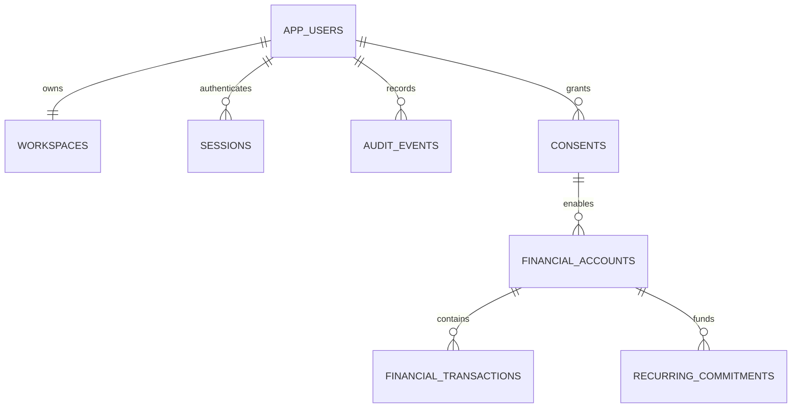

# Architecture

Mobile Expo Router screens call the authenticated `/api/v1` interface. Request schemas validate input; auth establishes user/session ownership; a locked store mutation checks revision and session again. FinancialService operates on that user's workspace. shared/finance computes recurrence, calendar events, safe-to-spend and account pressure using integer AUD cents and civil dates. BankingProvider and IdentityProvider separate external integrations from domain code.

The default MemoryStore is volatile development storage. PostgresStore uses relational users, workspaces (profile/revision), sessions, audit, consents, accounts, financial transactions and commitments. A transaction reads a consistent workspace; financial updates and audit insertions share the same commit. Account and commitment relationships include user_id in foreign keys. Provider identifiers are unique within the owner/account or consent boundary.

The synchronous banking boundary is only a sample-data adapter. Real provider HTTP requests must occur outside row locks with validated snapshots, consent/revision rechecks, provider idempotency and reconciliation. Request logs contain generated request IDs, route templates, method/status and elapsed time; no bodies, credentials or merchant data. Readiness checks the store, not the full provider ecosystem. Production deployment is gated.
